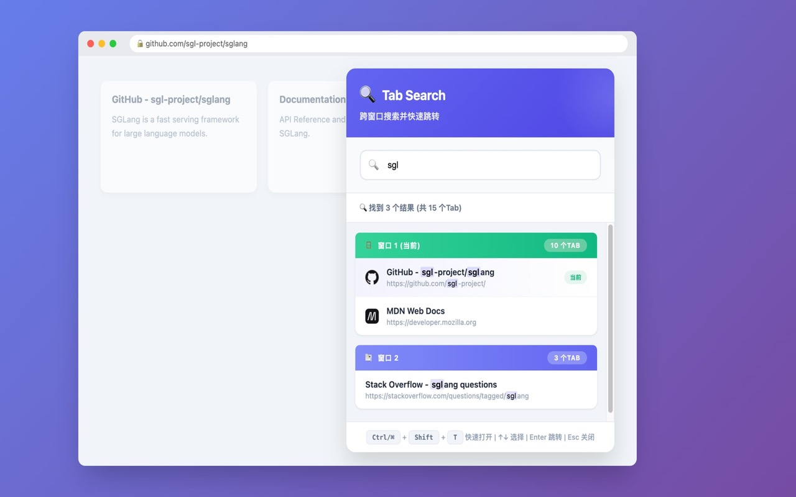
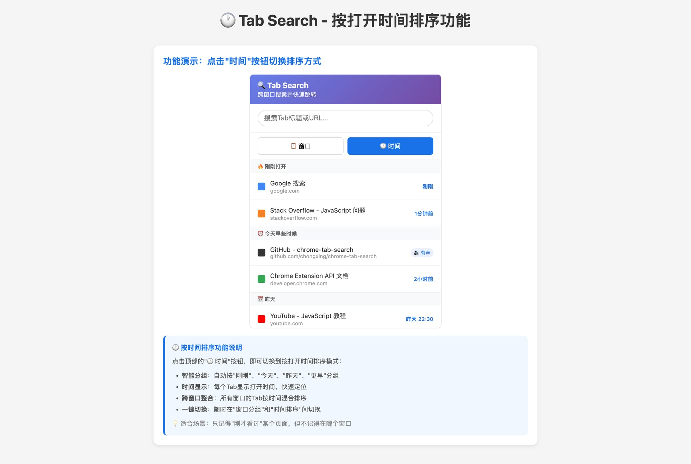

# Tab Search - Cross Window 🔍

[](https://github.com/chongxing/chrome-tab-search)
[](LICENSE)

> **开几十个 Tab 找不到想要的页面？**  
> 在多个 Chrome 窗口间来回切换太麻烦？  
> **Tab Search 帮你秒定位任意 Tab！**

一个轻量级 Chrome 扩展，让你在所有窗口中快速搜索并跳转到指定的 Tab。



## 🕐 按时间排序功能

点击顶部的"🕐 时间"按钮，Tab 会按打开时间重新排序，最近打开的排在最前面：



**特点：**
- 🔥 **智能分组**：自动按"刚刚"、"今天"、"昨天"、"更早"分组
- ⏰ **时间显示**：每个 Tab 显示打开时间，快速定位
- 🌐 **跨窗口整合**：所有窗口的 Tab 按时间混合排序
- 🔄 **一键切换**：随时在"窗口分组"和"时间排序"间切换

> 💡 **适用场景**：只记得"刚才看过"某个页面，但不记得在哪个窗口

---

## ✨ 核心功能

| 功能 | 说明 |
|------|------|
| 🔍 **跨窗口搜索** | 同时搜索所有 Chrome 窗口的 Tab，不只是当前窗口 |
| ⚡ **实时过滤** | 输入关键词即时过滤 Tab 标题和 URL |
| 🎯 **一键跳转** | 选中后自动聚焦窗口并激活目标 Tab |
| ⌨️ **键盘操作** | 全程无需鼠标，快捷键操作 |
| 🪟 **智能分组** | 按窗口分组显示，当前窗口优先 |
| 🔊 **状态标识** | 显示当前 Tab、播放声音的 Tab |

---

## 🚀 快速开始（推荐）

### 方式一：下载安装（最简单，无需 Chrome Web Store）

1. **下载** → 点击下载 [`chrome-tab-search-store-v1.0.3.zip`](./chrome-tab-search-store-v1.0.3.zip)（推荐最新版）
2. **解压** → 将 ZIP 解压到任意文件夹
3. **安装** → 打开 Chrome，访问 `chrome://extensions/`
4. **开启开发者模式** → 打开右上角开关
5. **加载扩展** → 点击「**加载已解压的扩展程序**」，选择解压后的文件夹
6. **完成！** → 插件图标会出现在浏览器工具栏

> 💡 **提示**：建议点击工具栏的 📌 图标将扩展固定，方便随时使用

### 方式二：克隆源码安装

```bash
git clone https://github.com/chongxing/chrome-tab-search.git
cd chrome-tab-search
```

然后在 Chrome 中加载已解压的扩展程序，选择此文件夹。

---

## ⌨️ 使用方法

| 操作 | 快捷键 / 操作 |
|------|--------------|
| 打开搜索 | `Ctrl+Shift+T`（Mac: `⌘+Shift+T`）或点击图标 |
| 搜索 Tab | 输入关键词（标题或 URL） |
| 选择结果 | `↑/↓` 键或鼠标悬停 |
| 跳转到 Tab | `Enter` 键或点击 |
| 关闭搜索 | `Esc` 键 |

---

## 🎯 适用人群

- 👨‍💻 **开发者** - 同时开多个项目文档
- 📊 **分析师** - 多窗口对比数据
- 📚 **研究者** - 大量资料标签管理
- 💼 **办公族** - 提升浏览器操作效率

---

## 📦 文件说明

```
chrome-tab-search/
├── manifest.json                    # 扩展配置
├── popup.html / popup.js / styles.css   # 界面和逻辑
├── icons/                           # 图标文件
├── chrome-tab-search-store-v1.0.3.zip   # 📦 推荐下载此文件安装
├── PRIVACY_POLICY.md               # 隐私政策
└── README.md                       # 本文件
```

---

## 🔒 隐私说明

- ✅ **纯本地运行** - 零数据上传
- ✅ **仅读取 Tab 信息** - 不访问网页内容
- ✅ **无广告、无追踪、无付费**
- ✅ **开源透明** - 代码完全公开

---

## 📝 快捷键自定义

如需修改快捷键：
1. 打开 `chrome://extensions/`
2. 点击左侧「**键盘快捷键**」
3. 找到「Tab Search」进行修改

---

## 🌐 Chrome Web Store

> Chrome Web Store 版本正在审核中，审核通过后会上架。  
> 目前推荐通过上方「快速开始」方式安装。

---

## 📣 推荐文案

> **分享给你的朋友：**
>
> 🔥 推荐一个超实用的 Chrome 扩展！  
> 经常开几十个 Tab 找不到？试试 Tab Search！  
> ✨ 跨窗口搜索所有 Tab，快捷键秒开秒找  
> 🎯 一键跳转，效率翻倍！  
> 
> 📥 安装：https://github.com/chongxing/chrome-tab-search  
> （Chrome Web Store 审核中，目前可直接从 GitHub 下载安装）

---

## 🤝 贡献

欢迎 Issue 和 PR！如果你有任何建议或发现 bug，请随时反馈。

---

## 📄 许可

MIT License © [chongxing](https://github.com/chongxing)

---

Made with ❤️ for multi-window users
